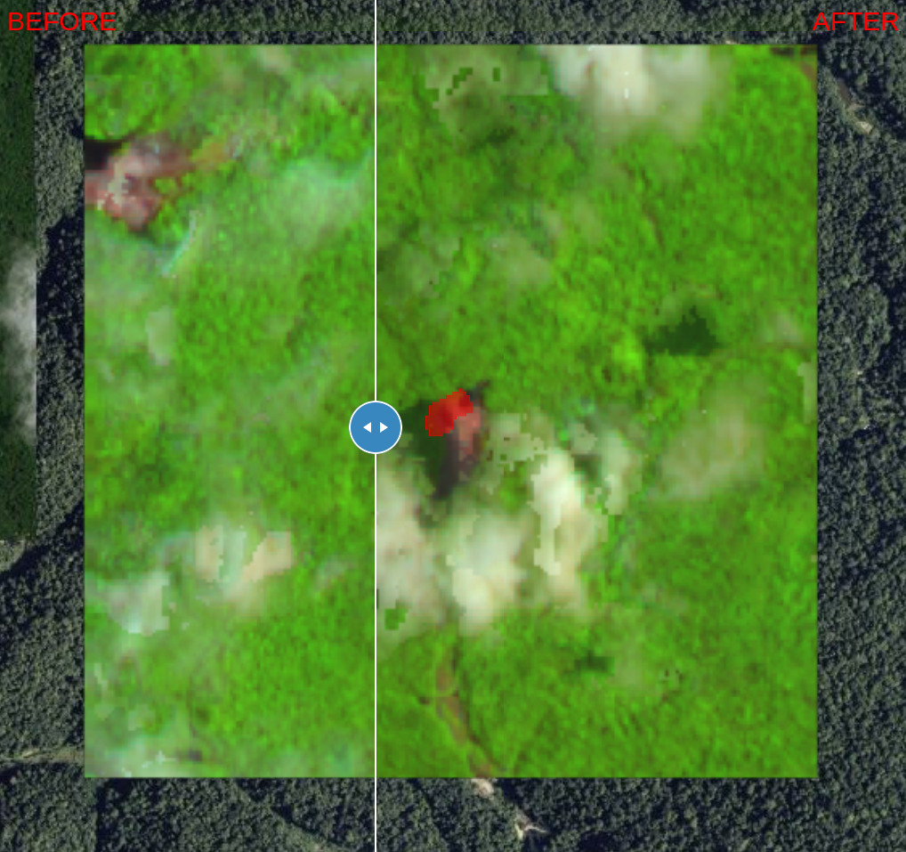
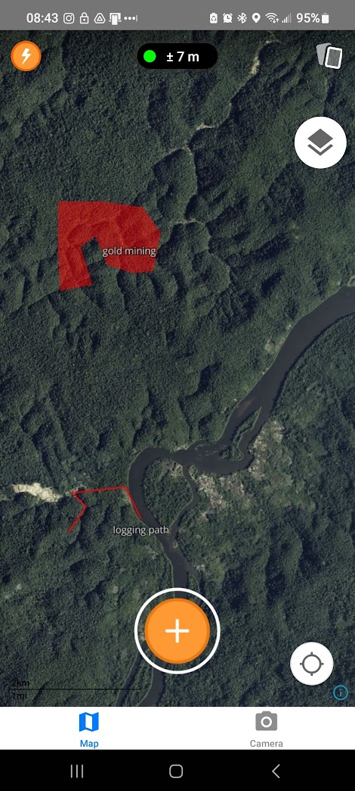

# GuardianConnector Change Detection

A Dockerized Python script which processes a GeoJSON input and generates several outputs for rendering on satellite imagery maps. In addition, it prepares offline map resources to load the data in data collection applications such as Kobo/ODK Collect and Mapeo.

You can execute this script in one of three ways:
1) using Docker Compose
2) directly with Python (which will require installing some dependencies)
3) via HTTP service endpoint (also running in Docker)

## Steps

The script follows these steps:

1. Copy GeoJSON file to outputs directory
2. Get bounding box for GeoJSON (all features)
3. Generate Generate PMTiles for GeoTIFFS (if provided)
4. Generate HTML map for previewing change detection alert (a swipe map if GeoTIFFs are provided)
5. Generate vector MBTiles from GeoJSON
6. Generate raster XYZ tiles from satellite imagery and bounding box
7. Convert raster XYZ directory to MBTiles
8. Generate stylesheet with both raster and vector MBTiles files
9. Download and copy over fonts and glyphs (needed for map style)
10. Generate overlay map HTML map (to preview style)
11. Serve maps using `tileserver-gl`
12. Generate composite MBTiles from `tileserver-gl` map loading the style

For Python, these steps are all contained in the gccd package's `main.py` script. For Docker, we need to split these up due to compose service orchestration; steps 1-9 are handled in  `docker-generate.py`, step 10 is handled by running a `tileserver-gl` service, and step 11 is handled in `docker-tileserver-compile.py`.

## Configure

These are the environmental variables you will need to provide in your hosting environment.

* `MAP_ZOOM`: Default zoom level for your HTML map. Defaults to 1 if not provided.
* `MAP_CENTER_LONGITUDE`: Default center longitude for your HTML map. Defaults to 0 if not provided.
* `MAP_CENTER_LATITUDE`: Default center latitude for your HTML map. Defaults to 0 if not provided.
* `RASTER_IMAGERY_URL` <span style="color:red">(required)</span>: URL for the source of your satellite imagery tiles that will be downloaded for offline usage. Note that if an API token is required that it must be appended to this URL.
* `RASTER_IMAGERY_ATTRIBUTION`: Attribution for your satellite imagery source. Currently this is added to the metadata of the raster MBTiles file.
* `RASTER_MBTILES_MAX_ZOOM`: Maximum zoom level up until which imagery tiles will be downloaded. Defaults to 14 if not provided.
* `RASTER_BUFFER_SIZE`: A buffer (in kilometers) to expand the imagery download beyond the bounding box of your GeoJSON file. Defaults to 0 if not provided.
* `PORT` <span style="color:grey">(for GCCD Python script)</span>: If running the Python scripts outside of Docker, you may choose to specify a different port for `tileserver-gl` to run on. Defaults to 8080 if not specified.
* `ALLOWED_API_KEY`  <span style="color:grey">(for HTTP server)</span>: To authorize HTTP requests to the server endpoints.

For Python or Docker execution, create a `.env` file using the provided example as a template. 

## Run the script with Docker Compose

Execute the script using the command:

```
./run.sh --geojson [FILENAME].geojson --t0 t0.tif --t1 t1.tif --output [OUTPUT]
```

The `--t0` and `--t1` flags are optional and can be used to provide before (t0) and after (t1) GeoTIFFs that show what the landscape looked like before and after the change was detected.

The `--output` flag is optional and can be used to name the directory and any files like MBTiles differently than your input file. If omitted, the script will employ the input filename for outputs.

## Run the script with Python

See [`gccd_pkg/README.md`](gccd_pkg/README.md).

## Run the flow via HTTP service endpoint

See [`httpservice/README.md`](httpservice/README.md).

## Outputs

This script will generate a rasterized MBTiles format for tiles that overlay your input GeoJSON on top of a raster source (typically satellite imagery), as well as an HTML map to preview your input GeoJSON on a Maplibre style with a Bing maps satellite imagery background. If you are providing before (t0) and after (T1) GeoTIFFs, the HTML map will have a swipe tool to examine what the landscape looked like before and after the change was detected.

The script also generates a `mapgl-map` directory with map resources placed in accordance to the Mapbox/Maplibre GL style spec:

* **Vector MBTiles**: MBTiles format of the GeoJSON, intended for map stylesheets in data collection apps.
* **Raster MBTiles**: MBTiles format of the satellite imagery tiles.
* **Fonts and sprites**: font and sprite glyph resources required to load a Map GL map. Only Open Sans Regular is compiled (which is what is used in the style).
* **Stylesheet**: A `style.json` file which overlays the MBTiles on top of satellite imagery.

Outputs are systematically organized as follows (using `example` output):

```
example/
├── example.html
├── example.mbtiles
├── mapgl-map/
│   ├── config.json
│   ├── style.json
│   ├── index.html
│   ├── fonts/
│   │   └── Open Sans Regular/
│   │   │   ├── ... font glyphs
│   ├── sprites/
│   │   ├── ... (sprite image files)
│   └── tiles/
│       ├── example-raster.mbtiles
│       └── example-vector.mbtiles
└─ resources
    ├── example.geojson
    ├── example_t0.pmtiles
    ├── example_t1.pmtiles
    ├── example_t0.tif
    └── example_t1.tif
```

## How to use the outputs

For **ODK/Kobo Collect**, you can use the final raster MBTiles as a background map for any geo fields by [transferring them to your device](https://docs.getodk.org/collect-offline-maps/). This process is still somewhat cumbersome, involving either the use of a USB cable or `adb` (see link). Also, while ODK/Kobo Collect can render the vector MBTiles, it is done without styling; each feature is displayed in a different color picked by the applications.

 **Mapeo** can import raster MBTiles files directly using the background map manager UI. In the future, Mapeo will be able to render vector MBTiles too, and we can then retool this script (using the outputs in the `mapgl-map/` directory) to generate a file that conforms to the expected input from Mapeo.

## Screenshots



*HTML swipe map showing before and after GeoTIFFs and the GeoJSON alert*



*Raster mbtiles generated by this script loaded in Mapeo*
